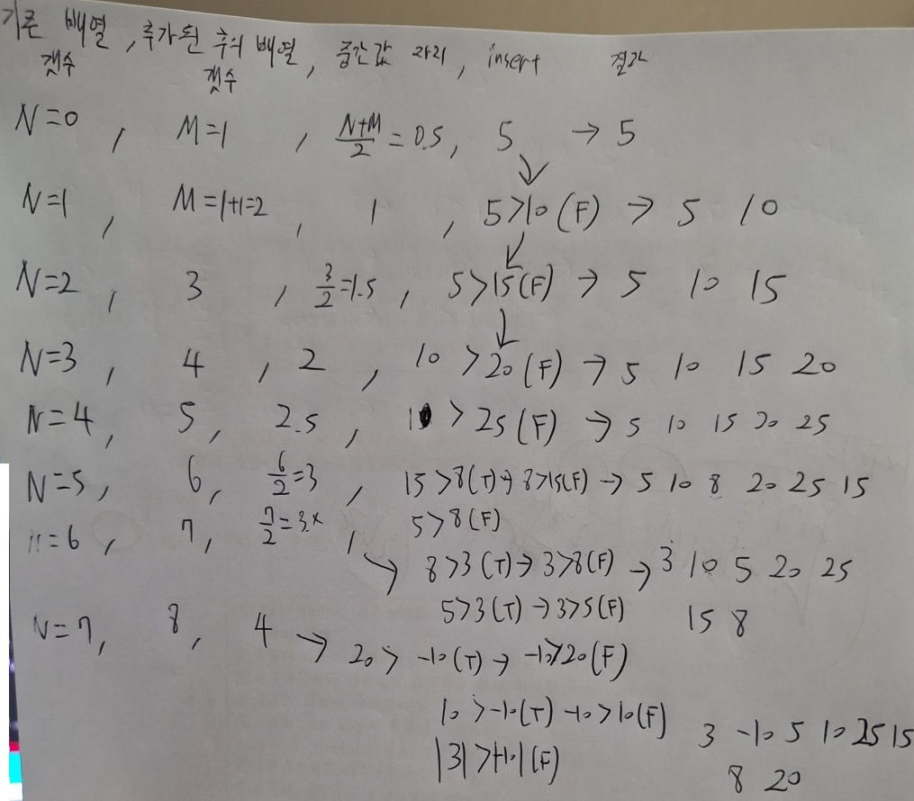

## 11286 에 관한 고찰

-목차 

1. 내용
1. 고찰 


# 내용

priority_queue에 관한 문제이며, 이를 활용하여 comp를 이용하여 풀 수 있는가를 확인하는 문제 
<code> priority_queue<int, vector<int>, cmp> </code> 

다음과 같은 형식을 사용하며, cmp가 이 문제의 핵심 요소 

```cpp
struct cmp {
    bool operator()(int a, int b) {
        if (abs(a) == abs(b)) {
            return a > b;
        }
        else {
            return abs(a) > abs(b);
        }
    }
}; 
```

a는 기존의 노드, b는 새로 입력된 노드로써 

**a와 b를 비교하여 True면 서로의 위치를 변경 False면 그대로 둔다**

와 같은 사용자 함수로 정의하여 문제를 풀 수 있었다. 

# 고찰

다만, 저 cmp가 언제 작동하는지에 대한 의문과 작동원리에 대하여 이해가 가지 않아, 디버깅을 통하여 확인하였다.

**cmp는 priority_queue의 호출 후 매번 일어난다**

**cmp는 완벽한 정렬이 아닌 들어온 한 변수만 정렬한다** 

다음과 같은 결론을 확인 할 수 있었다.

 

a = 추가할 배열의 중간 갯수 / b = 새로 들어온 입력 수

True 면 숫자 변경

False면 아예 뒤로 넘겨서 후 정렬 

알고리즘을 채택 하는 것을 볼 수 있다.